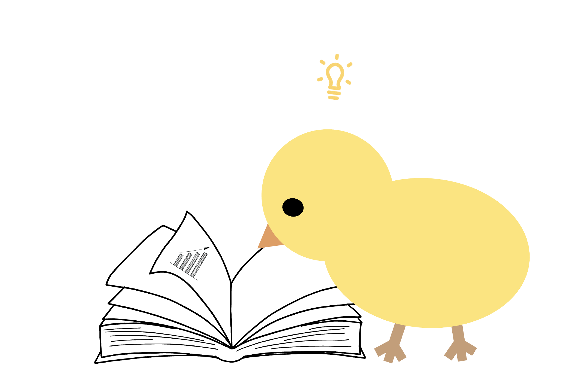

# ChiKen

ChiKen is your private, AI-powered research assistant that transforms your Zotero library into an interactive knowledge base. 

## ✨ Features

ChiKen connects your Zotero library to LLM Clients like Claude Desktop through **RAG** and **MCP**. Just make a few clicks, your AI clients are ready to search over your documents.

ChiKen chat interface offers three agents to interact with your research: **Chat** for conversational Q&A with your documents, **Search** for searching papers online, and **Deep Research** for comprehensive multi-source investigations that combine your personal library with web search to generate detailed research reports.

## 🚀 Quick Start

Download and install ChiKen from [Releases](https://github.com/yuanjua/chiken/releases) for your platform. PDF and text files work out-of-the-box; other formats require [pandoc](https://pandoc.org/) installation.

We recommend [Ollama](https://ollama.com/) for local LLMs—easy setup for chat and embeddings. You can then expose your knowledge bases to advanced LLMs like Claude Desktop through the built-in MCP server.

❓You may see prompts asking for keyring access: ChiKen stores your API-KEYs in your system if there are any.

For more detailed instructions, check out the docs: 
[Getting Started Guide](./docs/GETTING_STARTED.md).
[Claude MCP Setup and DEMO](./docs/mcp-claude-desktop-setup.md).
[Built-in Deep Research Agent DEMO](./docs/built-in-agents.md)

## 🗺️ What's Next

ChiKen continues to evolve with enhanced document parsing (lightweight and powerful options for literature), multi-modal understanding for images and PDFs using local LLMs, expanded MCP tools for deeper knowledge interaction, and architectural improvements including a planned shift to PyTauri for better performance.

## 🤝 Contributing

We’re excited to welcome contributions!  
A dedicated section with contribution guidelines and instructions is **coming soon**.  
If you have feature requests, bug reports, or ideas, feel free to open an issue or discussion in the meantime.

<!-- contributing: 
communitiy discussions/ feature requests, UI UX suggestions, introducing to your non-coder friend and send feedbacks. -->

## 💬 The Name

In the world of research, **Zotero** helps us *to see* and collect knowledge. The name comes from the Albanian word *zotëroj*, meaning "to master." But how do we turn that collection into true understanding?

This is the question that inspired **ChiKen (知見)**. The name comes from *jñāna-darśana* (ज्ञानदर्शन), a Buddhist term for "knowledge and insight." It represents the flash of understanding that comes from deep engagement with information.

ChiKen is designed to complete the journey Zotero begins: the mastery of information (Zotero) and the spark of insight (ChiKen). We want to help you not just collect knowledge, but to connect with it, question it, and ultimately, to see it in a new light.

## License

The code is licensed under the [MIT License](LICENSE).
The logo is licensed under [CC BY 4.0](./LICENSE-LOGO).
